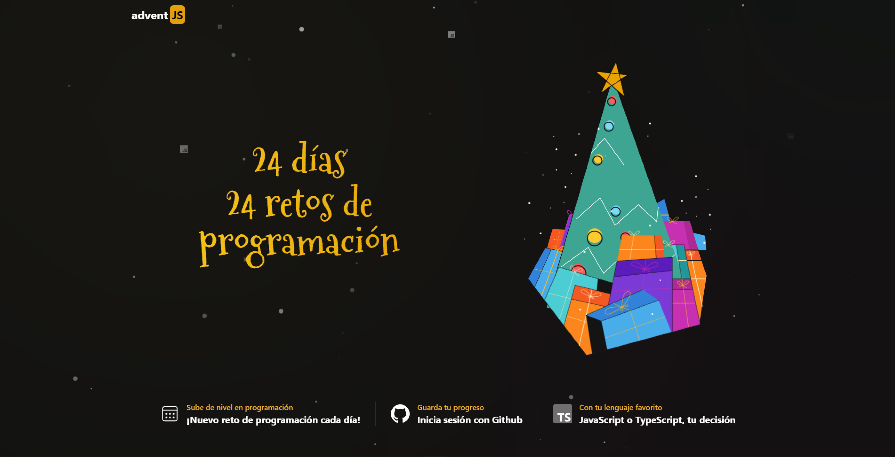
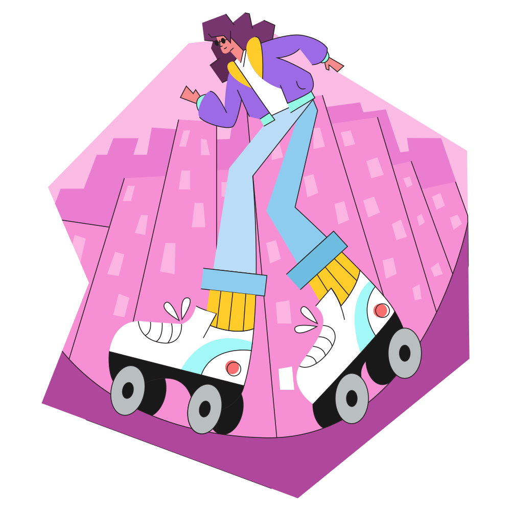
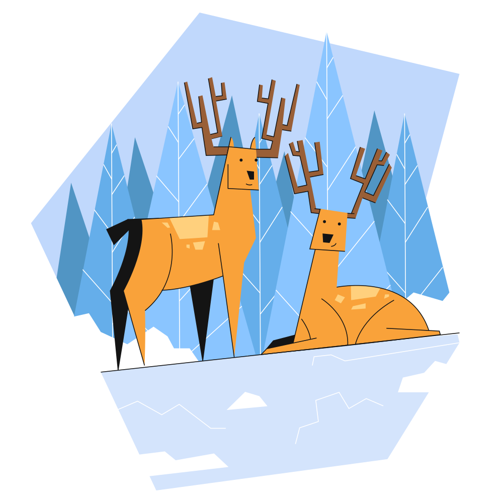
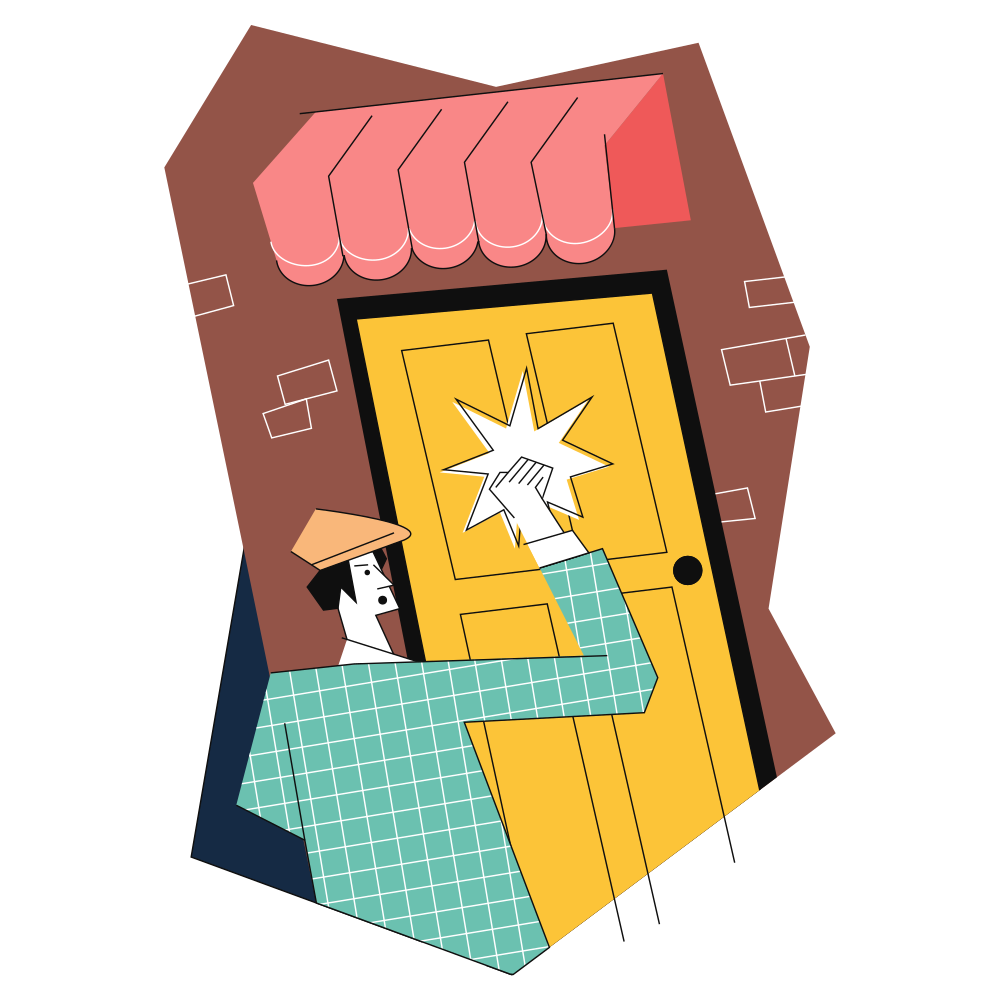
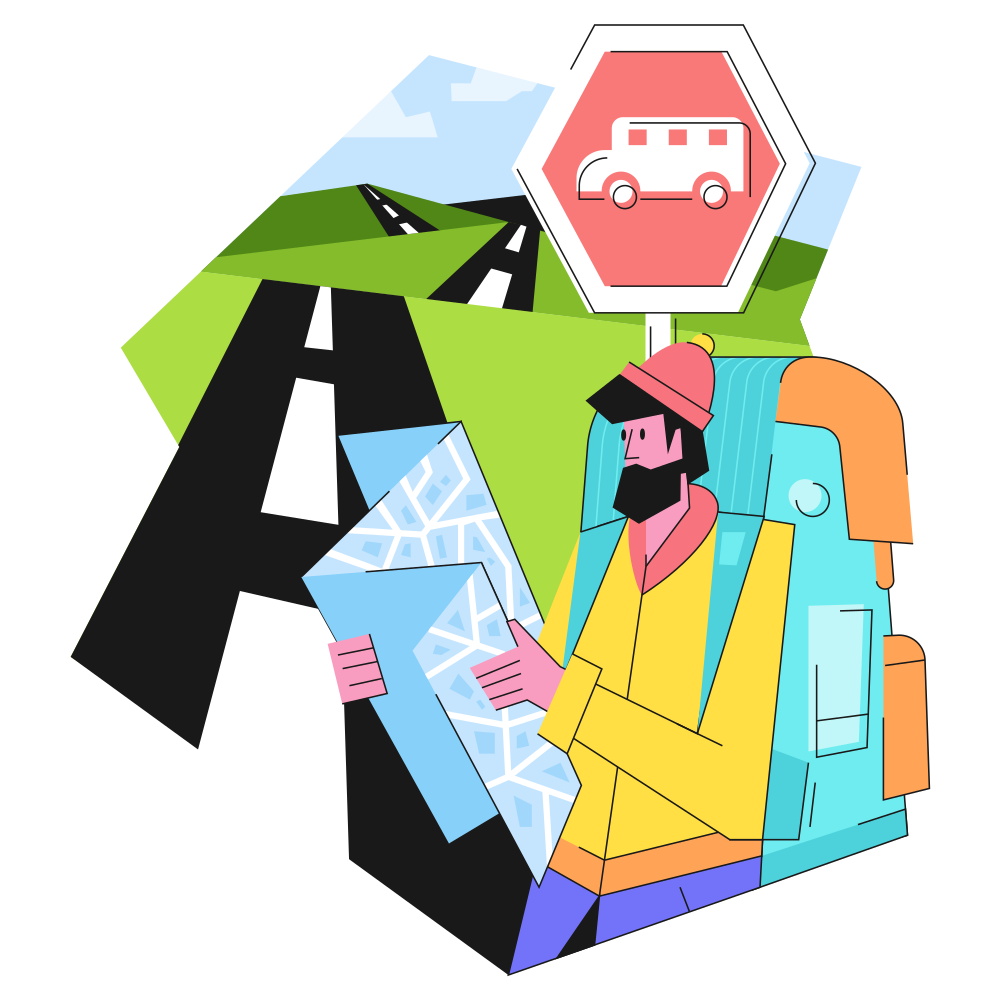

## Retos AdventJS 2022 🌟✨🎅🎄

##  [adventJS](https://adventjs.dev/es) es una iniciativa de [@midudev](https://midu.dev/)

## Retos 🎯

|                              Img                               | Reto |                                             Título                                             |            Solución            | Puntos |
| :------------------------------------------------------------: | :--: | :--------------------------------------------------------------------------------------------: | :----------------------------: | :----: |
|   | #01  |    [¡Automatizando envolver regalos de navidad!](https://adventjs.dev/es/challenges/2022/1)    | [Ver solución](./challenge01/) |  131   |
|   | #02  |          [Nadie quiere hacer horas extra](https://adventjs.dev/es/challenges/2022/2)           | [Ver solución](./challenge02/) |  121   |
|   | #03  | [¿Cuántas cajas de regalos puede llevar Papá Noel?](https://adventjs.dev/es/challenges/2022/3) | [Ver solución](./challenge03/) |  165   |
|   | #04  |      [Una caja dentro de otra caja y otra...](https://adventjs.dev/es/challenges/2022/4)       | [Ver solución](./challenge04/) |  172   |
|   | #05  |            [Optimizando viajes de Santa](https://adventjs.dev/es/challenges/2022/5)            | [Ver solución](./challenge05/) |  140   |
|   | #06  |             [Creando adornos navideños](https://adventjs.dev/es/challenges/2022/6)             | [Ver solución](./challenge06/) |  160   |
|   | #07  |          [Haciendo inventario de regalos](https://adventjs.dev/es/challenges/2022/7)           | [Ver solución](./challenge07/) |  400   |
|   | #08  |             [¡Necesitamos un mecánico!](https://adventjs.dev/es/challenges/2022/8)             | [Ver solución](./challenge08/) |  240   |
|   | #09  |            [Las locas luces de Navidad](https://adventjs.dev/es/challenges/2022/9)             | [Ver solución](./challenge09/) |  300   |
|  | #10  |         [El salto del trineo de Papá Noel](https://adventjs.dev/es/challenges/2022/10)         | [Ver solución](./challenge10/) |  260   |
|  | #11  |            [Papá Noel es Scrum Master](https://adventjs.dev/es/challenges/2022/11)             | [Ver solución](./challenge11/) |  260   |
|  | #12  |            [Trineos eléctricos, ¡guau!](https://adventjs.dev/es/challenges/2022/12)            | [Ver solución](./challenge12/) |  400   |
|  | #13  |       [Backup de los archivos de Papá Noel](https://adventjs.dev/es/challenges/2022/13)        | [Ver solución](./challenge13/) |  300   |
|  | #14  |                 [El mejor camino](https://adventjs.dev/es/challenges/2022/14)                  | [Ver solución](./challenge14/) |  300   |
|  | #15  |          [Decorando el árbol de Navidad](https://adventjs.dev/es/challenges/2022/15)           | [Ver solución](./challenge15/) |  260   |
|  | #16  |        [Arreglando las cartas de Papá Noel](https://adventjs.dev/es/challenges/2022/16)        | [Ver solución](./challenge16/) |  300   |
|  | #17  |          [Llevando los regalos en sacos](https://adventjs.dev/es/challenges/2022/17)           | [Ver solución](./challenge17/) |  260   |
|  | #18  |             [¡Nos quedamos sin tinta!](https://adventjs.dev/es/challenges/2022/18)             | [Ver solución](./challenge18/) |  200   |
|  | #19  |              [Ordenando los regalos](https://adventjs.dev/es/challenges/2022/19)               | [Ver solución](./challenge19/) |  400   |
|  | #20  |               [Más viajes retadores](https://adventjs.dev/es/challenges/2022/20)               | [Ver solución](./challenge20/) |   10   |
|  | #21  |           [Creando la tabla de regalos](https://adventjs.dev/es/challenges/2022/21)            | [Ver solución](./challenge21/) |  300   |
|  | #22  |            [La iluminación en sintonía](https://adventjs.dev/es/challenges/2022/22)            | [Ver solución](./challenge22/) |  400   |
|  | #23  |             [Compilador de Papá Noel](https://adventjs.dev/es/challenges/2022/23)              | [Ver solución](./challenge23/) |   10   |
|  | #24  |                                               ?                                                |               ?                |   ?    |
